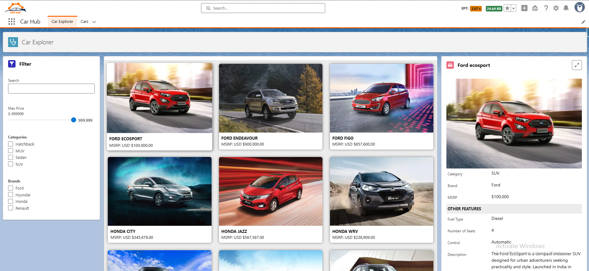
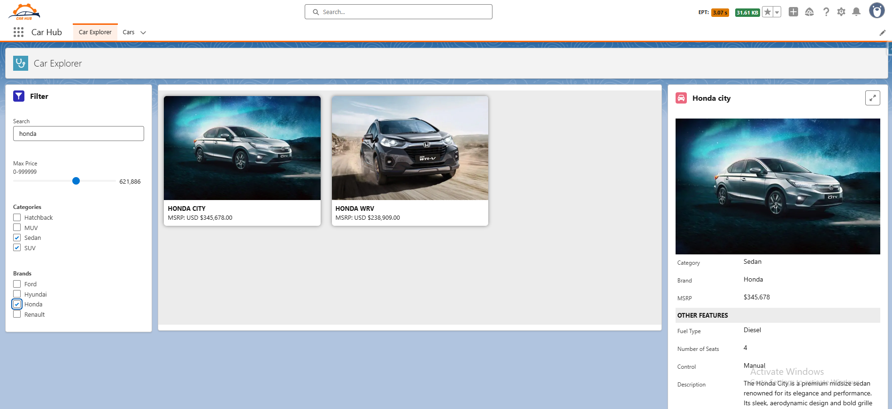
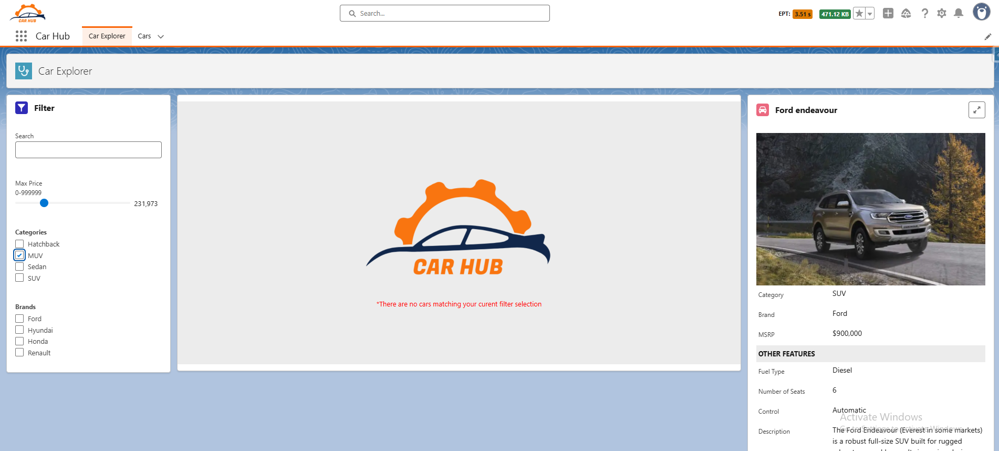
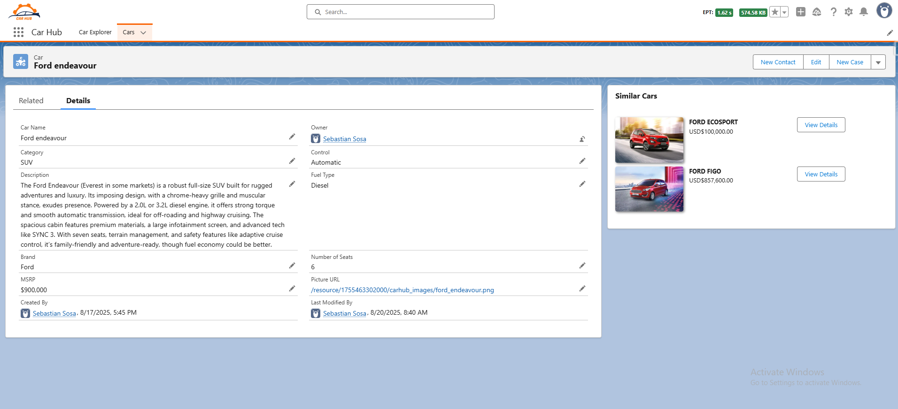

# CarHub: Salesforce LWC Car Browsing App

## Overview
CarHub is a Salesforce Lightning Web Components (LWC) application for browsing cars. Users can filter cars by name, price, category, and brand, view a grid of car tiles, see detailed car information, and explore similar cars. The app demonstrates modern Salesforce development practices, including Lightning Message Service (LMS) for component communication, Lightning Data Service (LDS) for efficient data fetching, and Apex for secure backend logic.

## Features
- **Dynamic Filtering**: Filter cars by name, max price, categories, and brands using a responsive filter component.
- **Car Grid**: Displays a grid of car tiles with name, image, and price, optimized for minimal data fetching.
- **Car Details**: Shows detailed car information (e.g., category, brand, fuel type) with a large image and navigation to the record page.
- **Similar Cars**: Lists cars with the same brand as the selected car, with navigation support.
- **Responsive UX**: Includes loading spinners for asynchronous data fetching and user-friendly error handling via toast notifications.
- **Production-Ready**: No console logs, secure data access with FLS enforcement, and optimized performance.

## Screenshots






## Architecture
- **Components**:
  - **CarHubFilter**: Allows users to input filter criteria (name, price, categories, brands) and publishes updates via LMS.
  - **CarHubTileList**: Subscribes to filter updates, fetches filtered cars via Apex, and displays a grid of car tiles.
  - **CarHubTile**: Renders individual car tiles and dispatches click events to the parent.
  - **CarHubCard**: Subscribes to car selection via LMS, fetches full car details using LDS, and supports navigation to the record page.
  - **CarHubSimilarCars**: Fetches and displays cars with the same brand as the selected car, with navigation support.
- **Apex Controller** (`CarsController`): Handles secure data retrieval with dynamic SOQL and FLS enforcement (`WITH SECURITY_ENFORCED`).
- **Message Channels**:
  - `carHubFilters__c`: Broadcasts filter updates from `CarHubFilter` to `CarHubTileList`.
  - `carHubDetails__c`: Sends selected car ID from `CarHubTileList` to `CarHubCard`.

## Prerequisites
- Salesforce org
- User permissions for the `Car__c` custom object and its fields (`Name`, `Brand__c`, `Category__c`, `MSRP__c`, `Picture_URL__c`, `Fuel_Type__c`, `Number_of_Seats__c`, `Control__c`).
- Salesforce CLI and VS Code for deployment.

## Included Files
- **car_records.csv**: CSV file containing sample `Car__c` records for testing the app.
- **car_fields.docx**: Docx file detailing the `Car__c` object’s field definitions and schema.
- **car_images.zip**: Zip file with car images to be uploaded as a Salesforce static resource for `Picture_URL__c` fallbacks.

## Setup Instructions
1. **Clone the Repository**:
   ```bash
   git clone https://github.com/1986SebastianSosa/lwc-carhub/
   cd carhub
    ```

2. **Deploy to Salesforce Org**:
- Authenticate with your org:
    ```
    sfdx force:auth:web:login -a <alias>
    ```
- Deploy the metadata:
    ```
    sfdx force:source:deploy -p force-app
    ```
3. **Configure the App**:
- Ensure the Car__c custom object and fields are set up in your org, as described in car_fields.docx.
- Verify Field-Level Security (FLS) for all fields in the user’s profile.
- Create the carHubFilters__c and carHubDetails__c message channels in Setup > Custom Metadata Types > Message Channel.

4. **Upload Static Resource**:
-Upload the car_images.zip file static resource named "carhub_images" in Setup > Static Resources.

5. **Import Car Data**:
- Use Data Import Wizard or Salesforce CLI to import car_records.csv into the Car__c object
- Ensure Picture_URL__c fields reference valid HTTPS URLs or static resource paths.

6. **Add to Lightning App Page**:
- Drag the CarHubFilter, CarHubTileList, and CarHubCard components onto an 3 section Lightning App Page.
- Optionally, place CarHubSimilarCars near CarHubCard for related cars.

7. **Test the App**:
- Create sample Car__c records with valid data (e.g., Picture_URL__c with HTTPS URLs).
- Open the Experience Cloud page and test filtering, car selection, and navigation.

## Best Practices Implemented
- Security: Enforces FLS in Apex with WITH SECURITY_ENFORCED and LDS in CarHubCard.
- Error Handling: User-friendly toast notifications (ShowToastEvent) instead of console logs for production readiness.
- Modularity: LMS for decoupled component communication, with lean state management and reactive properties.
- Scalability: Optimized data fetching (partial fields for lists, full fields for details) and clean lifecycle management.

## Challenges Overcome
- **Optimizing Data Fetching**: Initially fetched all `Car__c` fields for the list view, but switched to partial fields (`Id`, `Name`, `Picture_URL__c`, `MSRP__c`) in `CarHubTileList` and full fields on-demand in `CarHubCard`, reducing payload size and respecting governor limits.
- **LMS Decoupling**: Faced issues with component communication; implemented LMS (`carHubFilters__c`, `carHubDetails__c`) to decouple `CarHubFilter` and `CarHubTileList`, ensuring scalability and modularity.
- **UX with Async Data**: Added loading spinners in `CarHubTileList`, `CarHubCard`, and `CarHubSimilarCars` to handle asynchronous Apex and LDS calls, improving user experience during data fetching.
- **Optimized LMS Communication**: Initially used a single message channel for all component communication, but introduced separate channels (`carHubFilters__c` for filter updates, `carHubDetails__c` for car selection) to reduce unnecessary processing in subscribing components, improving performance and modularity.

## Project Structure
```
carhub/
├── force-app/
│   ├── main/
│   │   ├── default/
│   │   │   ├── lwc/
│   │   │   │   ├── carHubFilter/
│   │   │   │   │   ├── carHubFilter.js
│   │   │   │   │   ├── carHubFilter.html
│   │   │   │   │   ├── carHubFilter.css
│   │   │   │   │   ├── carHubFilter.js-meta.xml
│   │   │   │   ├── carHubTileList/
│   │   │   │   │   ├── carHubTileList.js
│   │   │   │   │   ├── carHubTileList.html
│   │   │   │   │   ├── carHubTileList.css
│   │   │   │   │   ├── carHubTileList.js-meta.xml
│   │   │   │   ├── carHubTile/
│   │   │   │   │   ├── carHubTile.js
│   │   │   │   │   ├── carHubTile.html
│   │   │   │   │   ├── carHubTile.css
│   │   │   │   │   ├── carHubTile.js-meta.xml
│   │   │   │   ├── carHubCard/
│   │   │   │   │   ├── carHubCard.js
│   │   │   │   │   ├── carHubCard.html
│   │   │   │   │   ├── carHubCard.css
│   │   │   │   │   ├── carHubCard.js-meta.xml
│   │   │   │   ├── carHubSimilarCars/
│   │   │   │   │   ├── carHubSimilarCars.js
│   │   │   │   │   ├── carHubSimilarCars.html
│   │   │   │   │   ├── carHubSimilarCars.css
│   │   │   │   │   ├── carHubSimilarCars.js-meta.xml
│   │   │   │   ├── carHubPlaceholder/
│   │   │   │   │   ├── carHubPlaceholder.js
│   │   │   │   │   ├── carHubPlaceholder.html
│   │   │   │   │   ├── carHubPlaceholder.css
│   │   │   │   │   ├── carHubPlaceholder.js-meta.xml
│   │   │   ├── apex/
│   │   │   │   ├── CarsController.cls
│   │   │   │   ├── CarsController.cls-meta.xml
│   │   │   ├── customMetadata/
│   │   │   │   ├── carHubFilters__c.mdt
│   │   │   │   ├── carHubDetails__c.mdt
│   │   │   ├── objects/
│   │   │   │   ├── Car__c/
│   │   │   │   │   ├── Car__c.object-meta.xml
│   │   │   │   │   ├── fields/
│   │   │   │   │   │   ├── Name.field-meta.xml
│   │   │   │   │   │   ├── Brand__c.field-meta.xml
│   │   │   │   │   │   ├── Category__c.field-meta.xml
│   │   │   │   │   │   ├── MSRP__c.field-meta.xml
│   │   │   │   │   │   ├── Picture_URL__c.field-meta.xml
│   │   │   │   │   │   ├── Fuel_Type__c.field-meta.xml
│   │   │   │   │   │   ├── Number_of_Seats__c.field-meta.xml
│   │   │   │   │   │   ├── Control__c.field-meta.xml
│   │   │   ├── staticresources/
│   │   │   │   ├── carImages.resource
│   │   │   │   ├── carImages.resource-meta.xml
│   ├── resources/
│   │   ├── carhub_images.zip
│   │   ├── Car_fields_and_relationship.docx
│   │   ├── Car_data.scv
├── README.md
├── sfdx-project.json


```

## Contact
For questions or contributions, contact Sebastian Sosa at [1986SebastianSosa@gmail.com] (mailto:1986SebastianSosa@gmail.com) or though my [LinkedIn](https://www.linkedin.com/in/sebastian-sosa-cinotti/).